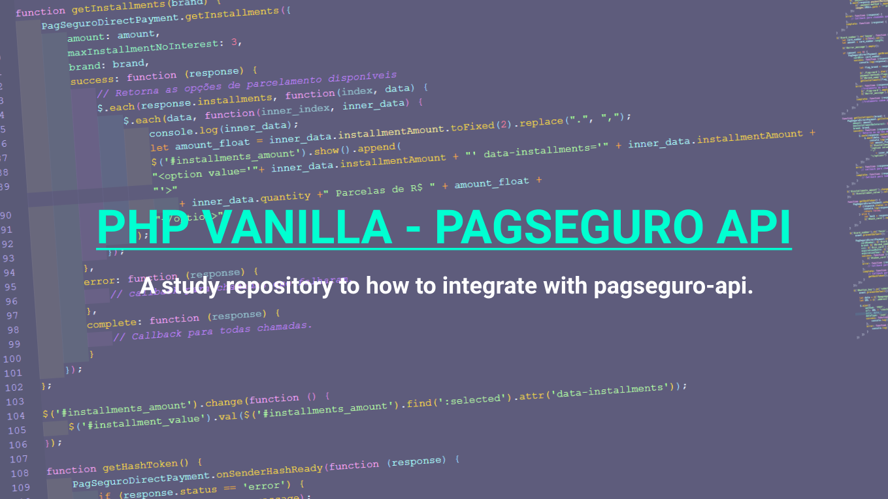

# 😀 PHP VANILLA - PAGSEGURO API

---

## 📝 About the Project

A study repository to how to integrate with pagseguro-api.
This comes as a future reference.

## 📱 Meta

Dheyson Alves – [@DheysonAlves2](https://twitter.com/DheysonAlves2) – dheyson10@gmail.com

## Future

- Integrate with notification status API
- Save on database data

## 👋 Contributing

1. Fork it (<https://github.com/Dheyson/awesome-form-jquery-validator/fork>)
2. Create your feature branch (`git checkout -b feature/fooBar`)
3. Commit your changes (`git commit -am 'Add some fooBar'`)
4. Push to the branch (`git push origin feature/fooBar`)
5. Create a new Pull Request
